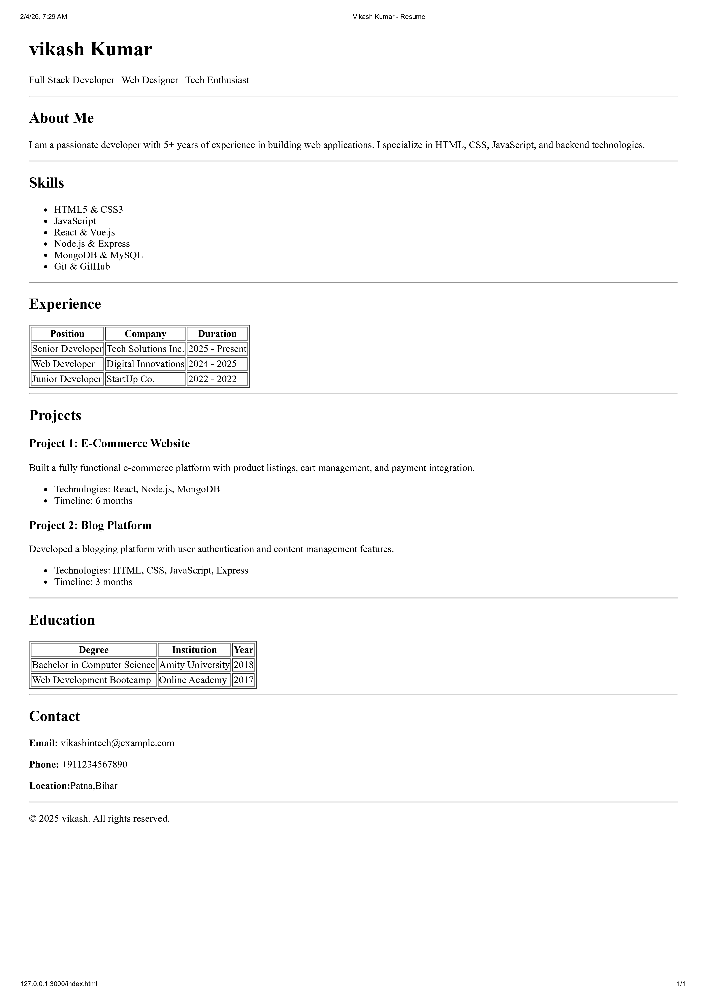

# HTML Resume Page

A single-page resume website built with pure HTML for the Web Dev Cohort 2026 assignment.

## Overview

This project is a clean, semantic HTML resume page that showcases personal information, skills, experience, projects, education, and contact details.

##  Setup Steps

1. Clone the repository:

   ```bash
   git clone https://github.com/cypherninjaa/Assignments.git
   ```

2. Navigate to the project folder:

   ```bash
   cd Assignments
   ```

3. Open the `index.html` file in your browser:
   - Double-click on `index.html`, or
   - Right-click and select "Open with" your preferred browser, or
   - Use VS Code Live Server extension

##  Project Structure

```
Assignments/
├── index.html    # Main resume page
└── README.md     # Documentation
```

##  Usage

Simply open `index.html` in any modern web browser to view the resume. No additional dependencies or build steps required.

##  Features

- **Header Section**: Name and professional title
- **About Me**: Brief personal introduction
- **Skills**: Technical skills list
- **Experience**: Work history in table format
- **Projects**: Notable projects with descriptions
- **Education**: Academic background in table format
- **Contact**: Contact information
- **Footer**: Copyright notice

##  HTML Tags Used

- Semantic elements: `<header>`, `<section>`, `<footer>`
- Headings: `<h1>`, `<h2>`, `<h3>`
- Paragraphs: `<p>`
- Lists: `<ul>`, `<li>`
- Tables: `<table>`, `<thead>`, `<tbody>`, `<tr>`, `<th>`, `<td>`
- Text formatting: `<strong>`
- Horizontal rules: `<hr>`

## Screenshot



##  Live Demo

[View Live Demo](https://cypherninjaa.github.io/Assignments/)
##  Author

cypherninjaa

##  License

© 2024 cypherninjaa. All rights reserved.